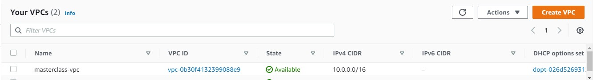
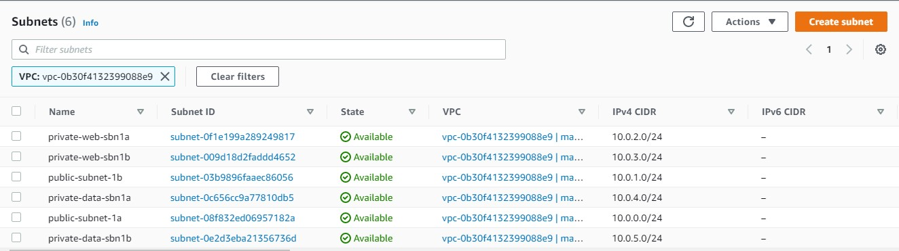

## AWS CLOUD SOLUTION FOR 2 COMPANY WEBSITES USING A REVERSE PROXY TECHNOLOGY ##
The power of Clouds is not only in being able to rent Virtual Machines – it is much more than that. From now on, we will gradually study 
different Cloud concepts and tools on example of AWS, GCP, Azure, etc. The principles are common across most of the major Cloud Providers.

This project builds an AWS VPC (Virtual Private Cloud) network for a fictitious company that uses WordPress CMS for its main business website, and a Tooling Website.
As part of the company’s desire for improved security and performance, a decision has been made to use a reverse proxy technology from NGINX to achieve this.

All recources are prefixed "masterclass" to delineate resources for this project from those of other projects

Create a VPC
Create 2 Public (Shared across two availability zones within the same region)
Create 4 Private Subnets (Shared across two availability zones within the same region)

Create Internet Gateway in to Public Subnet 1
Create NAT Gateways in to Public Subnets 1 and 2

Create Security Groups to allow traffic within the infrastructure:
 ([x]) Nginx Servers: Access to Nginx should only be allowed from a Application Load balancer (ALB). At this point, we have not created a load balancer, 
  therefore we will update the rules later. For now, just create it and put some dummy records as a place holder.
 ([x]) Bastion Servers: Access to the Bastion servers should be allowed only from workstations that need to SSH into the bastion servers. Hence, 
  you can use your workstation public IP address. To get this information, simply go to your terminal and type curl www.canhazip.com
 ([x]) Application Load Balancer: ALB will be available from the Internet
 ([x]) Webservers: Access to Webservers should only be allowed from the Nginx servers. Since we do not have the servers created yet, just put some dummy 
 records as a place holder, we will update it later.
 ([x]) Data Layer: Access to the Data layer, which is comprised of Amazon Relational Database Service (RDS) and Amazon Elastic File System (EFS) 
 must be carefully desinged – only webservers should be able to connect to RDS, while Nginx and Webservers will have access to EFS Mountpoint.
