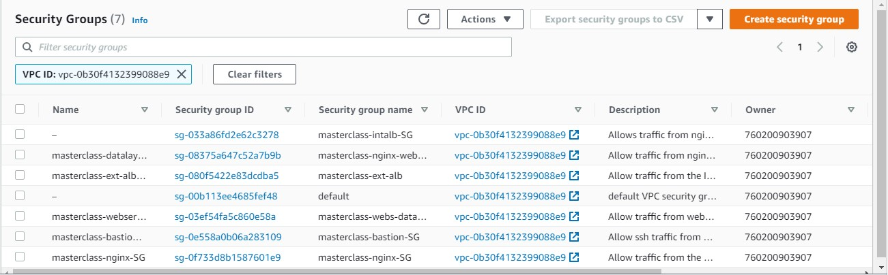
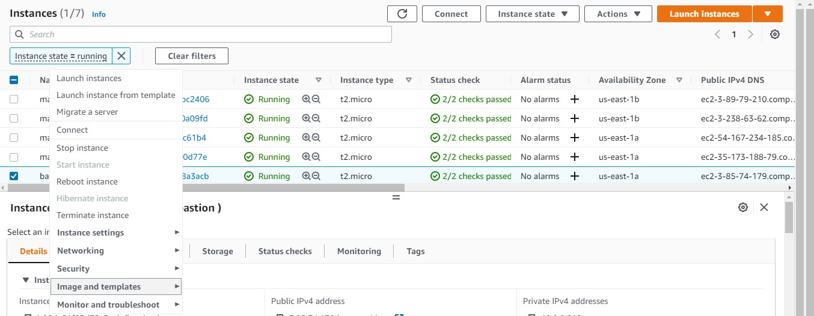
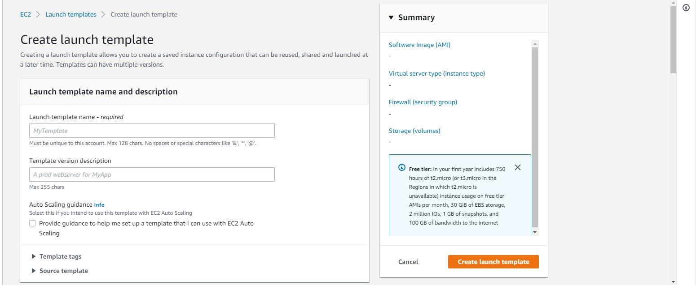

## AWS CLOUD SOLUTION FOR 2 COMPANY WEBSITES USING A REVERSE PROXY TECHNOLOGY ##

The power of Clouds is not only in being able to rent Virtual Machines – it is much more than that. From now on, we will gradually study 
different Cloud concepts and tools on example of AWS, GCP, Azure, etc. The principles are common across most of the major Cloud Providers.

This project builds an AWS VPC (Virtual Private Cloud) network for a fictitious company that uses WordPress CMS for its main business website, and a Tooling Website.
As part of the company’s desire for improved security and performance, a decision has been made to use a reverse proxy technology from NGINX to achieve this.

All recources are prefixed "masterclass" to delineate resources for this project from those of other projects

Create a VPC
Create 2 Public (Shared across two availability zones within the same region)
Create 4 Private Subnets (Shared across two availability zones within the same region)

Create Internet Gateway in to Public Subnet 1
Create NAT Gateways in to Public Subnets 1 and 2

Create Security Groups to allow traffic within the infrastructure:
 - [x] **Nginx Servers**: Access to Nginx should only be allowed from a Application Load balancer (ALB).
 - [x] **Bastion Servers**: Access to the Bastion servers should be allowed only from workstations that need to SSH into the bastion servers. Hence, 
  you can use your workstation public IP address.
 - [x] **Application Load Balancer**: ALB will be available from the Internet
 - [x] **Webservers**: Access to Webservers will be allowed from the Nginx servers. 
 - [x] **Data Layer**: Only webservers connect to RDS, while Nginx and Webservers will have access to EFS Mountpoint.

Create EC2 Instances that will form the bases for Bastion, Tooling, Nginx and WordPress AMIs
Launch 3 instances of Red Hat Linux t2.micro

Use the instructions in the link below to prepare the three instances

We are setting up these instances with the above instructions:
 Bastion
 Nignix
 Tooling
 Webserver
 
 Create an AMI from each of the configured instances
 
 
 With each AMI, create Launch Template.
 
 Ensure the Instances are launched into appropriate subnets
 
 Repeat for all the AMIs
 
 
 TLS Certificates From Amazon Certificate Manager (ACM)

1. Navigate to AWS ACM
1. Request a public wildcard certificate for the domain name you registered in Freenom
1. Use DNS to validate the domain name
1. Tag the resource

### CONFIGURE APPLICATION LOAD BALANCER (ALB) ###
**Application Load Balancer To Route Traffic To NGINX** (External)

Nginx EC2 Instances will have configurations that accepts incoming traffic only from Load Balancers. No request should go directly to Nginx servers. With this kind of setup, we will benefit from intelligent routing of requests from the ALB to Nginx servers across the 2 Availability Zones. We will also be able to offload SSL/TLS certificates on the ALB instead of Nginx. Therefore, Nginx will be able to perform faster since it will not require extra compute resources to valifate certificates for every request.

1. Create an Internet facing ALB
1. Ensure that it listens on HTTPS protocol (TCP port 443)
1. Ensure the ALB is created within the appropriate VPC | AZ | Subnets
1. Choose the Certificate from ACM
1. Select Security Group
1. Select Nginx Instances as the target group

**Application Load Balancer To Route Traffic To Web Servers** (Internal)

Since the webservers are configured for auto-scaling, there is going to be a problem if servers get dynamically scalled out or in. Nginx will not know about the new IP addresses, or the ones that get removed. Hence, Nginx will not know where to direct the traffic.

To solve this problem, we must use a load balancer. But this time, it will be an internal load balancer. Not Internet facing since the webservers are within a private subnet, and we do not want direct access to them.

1. Create an Internal ALB
1. Ensure that it listens on HTTPS protocol (TCP port 443)
1. Ensure the ALB is created within the appropriate VPC | AZ | Subnets
1. Choose the Certificate from ACM
1. Select Security Group
1. Select webserver Instances as the target group
1. Ensure that health check passes for the target group

Complete for both tooling and WordPress 

**Amazon Elastic File System (Amazon EFS)**
1. Create an EFS filesystem
1. Create an EFS mount target per AZ in the VPC, associate it with both subnets dedicated for data layer
1. Associate the Security groups created earlier for data layer.
1. Create an EFS access point for both tooling and wordpress sites. (Give it a name and leave all other settings as default)

**Setup RDS**
Pre-requisite: Create a KMS key from Key Management Service (KMS) to be used to encrypt the database instance.

Amazon Relational Database Service (Amazon RDS) is a managed distributed relational database service by Amazon Web Services. This web service running in the cloud designed to simplify setup, operations, maintenans & scaling of relational databases. Without RDS, Database Administrators (DBA) have more work to do, due to RDS, some DBAs have become jobless

To ensure that your databases are highly available and also have failover support in case one availability zone fails, we will configure a multi-AZ set up of RDS MySQL database instance. In our case, since we are only using 2 AZs, we can only failover to one, but the same concept applies to 3 Availability Zones. We will not consider possible failure of the whole Region, but for this AWS also has a solution – this is a more advanced concept that will be discussed in following projects.

1. Create a subnet group and add 2 private subnets (data Layer)
1. Create an RDS Instance for mysql 8.0.2
1. Configure other settings accordingly (For test purposes, most of the default settings are good to go). In the real world, you will need to size the database appropriately. You will need to get some information about the usage. If it is a highly transactional database that grows at 10GB weekly, you must bear that in mind while configuring the initial storage allocation, storage autoscaling, and maximum storage threshold.
1. Configure VPC and security (ensure the database is not available from the Internet)
1. Configure backups and retention
1. Encrypt the database using the KMS key created earlier
1. Enable CloudWatch monitoring and export Error and Slow Query logs (for production, also include Audit)
